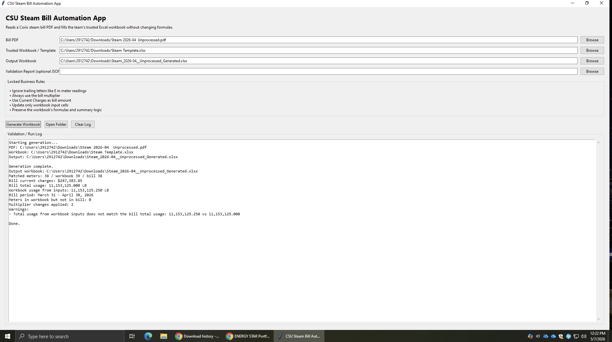
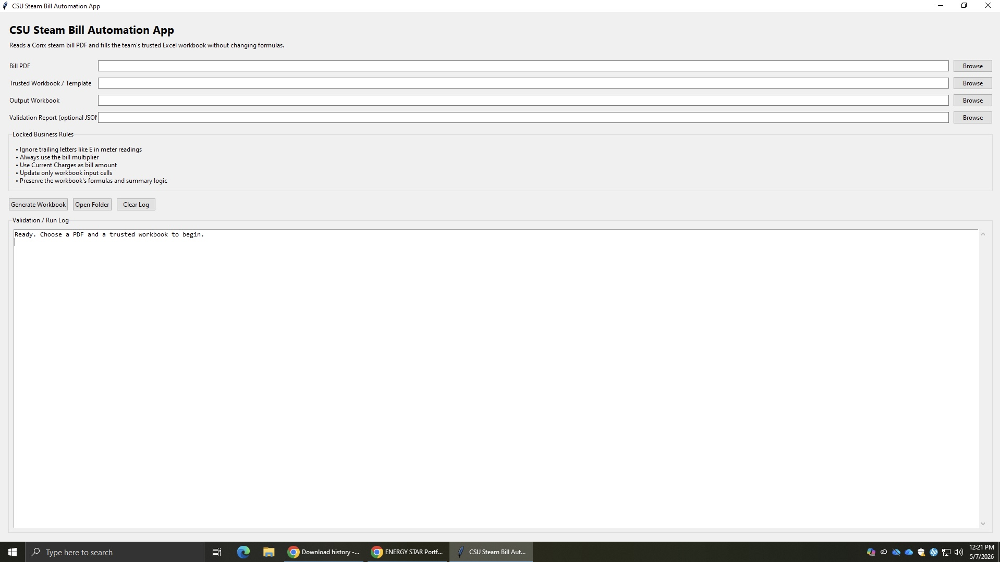
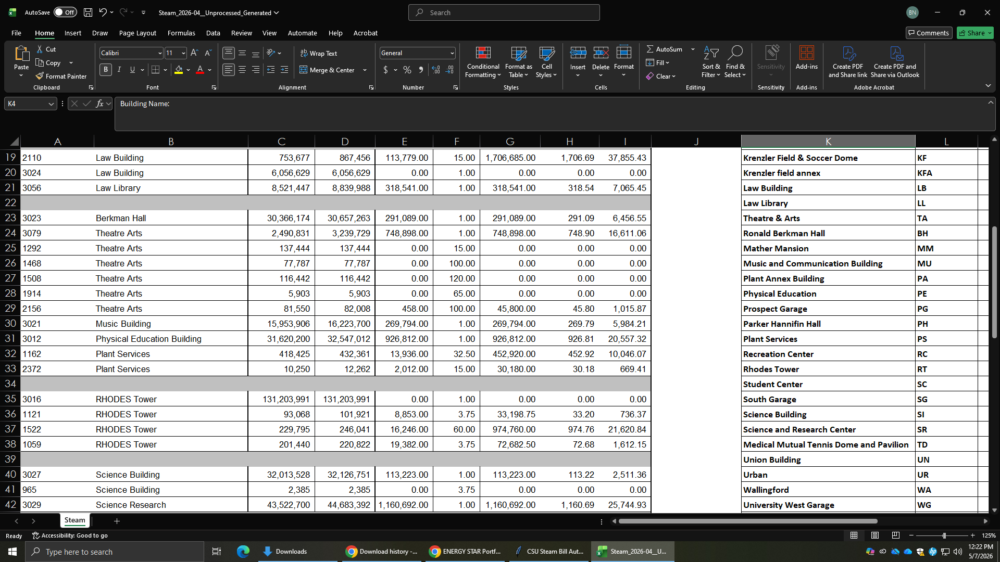

# Utility Bill Automation System

A Python desktop application that automates utility bill PDF extraction, validates meter-level billing data, and updates Excel workbook templates while preserving existing formulas and reporting logic.

## Overview

This project was built to reduce manual data entry in utility bill processing workflows. The application reads structured utility bill PDFs, extracts meter-level data, validates the extracted values, and writes the results into an Excel template used for monthly reporting.

## Key Features

- Extracts meter-level data from PDF utility bills
- Parses previous reads, current reads, usage, multipliers, billing period, and current charges
- Cleans numeric values and handles formatted readings
- Updates Excel templates using `openpyxl`
- Preserves existing workbook formulas and summary logic
- Detects missing meters, extra meters, multiplier changes, and usage mismatches
- Provides a desktop GUI for non-technical users
- Can be packaged into a standalone Windows `.exe`

## Tech Stack

- Python
- Tkinter
- pdfplumber
- openpyxl
- Regular Expressions
- PyInstaller
- Excel Automation

## Application Workflow

```text
PDF Utility Bill
      ↓
Text Extraction
      ↓
Meter Data Parsing
      ↓
Data Cleaning
      ↓
Validation Checks
      ↓
Excel Template Update
      ↓
Generated Workbook + Validation Report
```text
```

## Project Structure

```text
utility-bill-automation-system/
│
├── steam_bill_automation_app.py
├── requirements.txt
├── README.md
├── .gitignore
└── build_exe.bat
```

## How It Works

1. The user selects a utility bill PDF.
2. The app extracts text from the PDF using `pdfplumber`.
3. Meter-level rows are parsed using structured regex logic.
4. Numeric values are cleaned and converted into usable formats.
5. The app maps meter numbers to rows in the Excel template.
6. Only input cells are updated, so existing Excel formulas remain intact.
7. Validation checks are performed before final output is saved.

## Validation Checks

The application checks for:

- Missing meters in the bill
- Extra meters not found in the workbook
- Multiplier changes
- Usage mismatches
- Total usage mismatch
- Current charges consistency

## Installation

Clone the repository:

```bash
git clone https://github.com/bhanu-devv/utility-bill-automation-system.git
cd utility-bill-automation-system
```

Install dependencies:

```bash
pip install -r requirements.txt
```

Run the application:

```bash
python steam_bill_automation_app.py
```

## Build Windows Executable

To package the app as a standalone Windows executable:

```bash
py -m PyInstaller --onefile --windowed steam_bill_automation_app.py
```

The executable will be generated inside:

```text
dist/
```

## Business Impact

This automation reduces repetitive manual entry, improves consistency, and adds validation controls to utility billing workflows. It helps users process utility bills faster while reducing the risk of human error.

## Privacy Notice

This repository does not include real utility bills, account numbers, internal spreadsheets, or confidential organizational data. Any sample data used should be sanitized before public upload.

## Author

Bhanudeepak Nagumothu

## Application Screenshots

### Main Application UI



### Validation Workflow



### Generated Workbook Output


